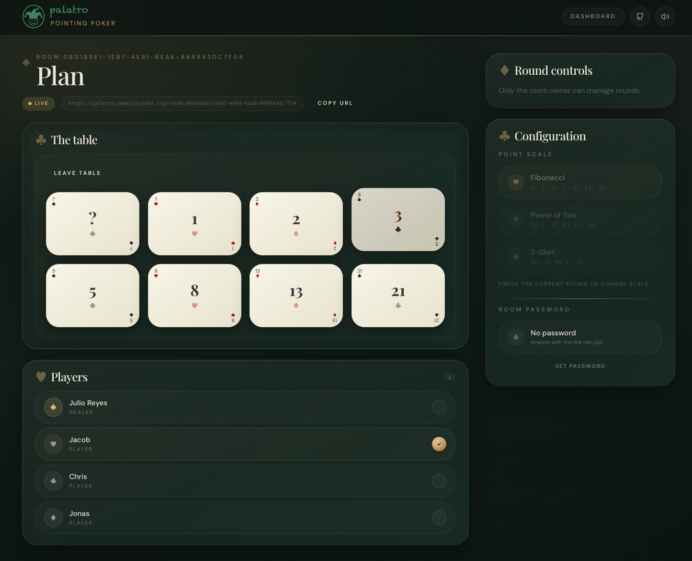

# Palatro

  
  

  

Palatro is a planning poker app for scrum teams that want fast, low-friction estimation sessions.

Create a room, share a link, let teammates join without accounts, pick a pointing scale, and vote together in real time.

## Built For Scrum Teams

Palatro is designed for story estimation sessions where speed matters more than ceremony. It works well for distributed teams, hybrid standups, and recurring planning meetings where you want a stable room and a simple flow that people can rejoin quickly.

## What Palatro Can Do

- create a room for an estimation session
- share one room link with the whole team
- let guests join with a nickname only
- optionally protect a room with a password
- choose the pointing scale: Fibonacci, power of two, or T-shirt sizing
- vote in real time
- reveal automatically when everyone has voted
- restart the round for the next story

## Why Use It

- low friction for guests because not everyone needs an account
- quick setup for recurring sprint planning or backlog refinement
- stable room links make it easy to reuse the same table with a team
- simple room controls keep the estimation flow moving

## Project Links

- [Local development](docs/local-development.md)
- [Self-hosting](docs/self-hosting.md)
- [Contributing](CONTRIBUTING.md)

## Tech Stack

- Better-T-Stack scaffold
- Bun
- TypeScript
- TanStack Start
- TanStack Router
- Tailwind CSS
- shadcn/ui primitives
- soundcn
- Convex
- Better Auth
- Turborepo
